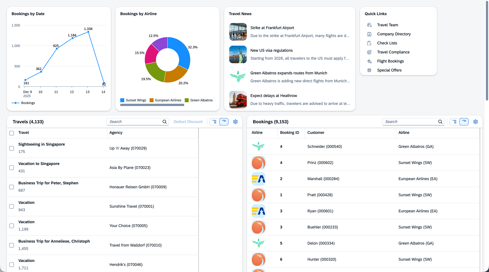

# Flexibility at Scale with Freestyle SAPUI5 and SAP Fiori elements

## Description

This hands-on session guides you through building a flexible travel dashboard and object-centric UX by combining SAP Fiori elements templates, building blocks (tables, filter bar), extensions (custom sections, controller extensions), and freestyle SAPUI5. You start from a proven CAP back end based on the SFLIGHT sample service (adapted from the public repository: [cap-sflight](https://github.com/SAP-samples/cap-sflight)). That repository is well worth exploring separately for deeper CAP patterns (service definitions, draft handling, data model evolution, analytical queries etc.).

## Overview

Across the exercises you will:
- Set up your development space in SAP Business Application Studio (Exercise 0).
- Generate a SAP Fiori elements Custom Page app bound to the CAP Travel service and enrich it with annotations and SAPUI5 integration cards (Exercise 1).
- Add and structure an Object Page with grouped form sections and a related Bookings table (Exercise 2). 

If you have extra time, you can try the following bonus exercise
- Use a custom geo map section, FilterBar + Table in an extension, and a controller extension injecting business validation (Exercise 3).

Key learning outcomes:
- How metadata drives UI generation and reduces boilerplate.
- How to extend with freestyle XML fragments while retaining SAP Fiori elements consistency.

Topics covered in the bonus exercise:
- Reuse of building blocks (Table, FilterBar) in both template and custom contexts.
- Implementing controller extensions for conditional logic in SAP Fiori elements without forking standard controllers.

## Requirements

Laptop, being able to login to SAP Business Application Studio via provided workshop-account, alternatively local installation of VS Code, Git, and latest SAP Fiori tools.

## Exercises

Start with [Exercise 0](exercises/ex0/README.md) to set up the environment before proceeding sequentially; each exercise builds on the previous one. Enjoy exploring flexibility at scale!

## Code of Conduct
Please read the [SAP Open Source Code of Conduct](https://github.com/SAP-samples/.github/blob/main/CODE_OF_CONDUCT.md).

## How to obtain support

Support for the content in this repository is available during the actual time of the online session for which this content has been designed. Otherwise, you may request support via the [Issues](../../issues) tab.

## License
Copyright (c) 2026 SAP SE or an SAP affiliate company. All rights reserved. This project is licensed under the Apache Software License, version 2.0 except as noted otherwise in the [LICENSE](LICENSES/Apache-2.0.txt) file.
